************* Backend-Application for ShoppyGloby *************

extract files from zip folder or clone the project from git hub.

git clone : https://github.com/prudhvi-marada/backend-shoppyGlobe.git 

install the dependecies : npm install 

run the applications    : npm start 

MongoDb Atlas:

💾  This project uses MongoDB Atlas, a cloud-hosted NoSQL database service, to store and manage product data, user information, and cart items.

Routes are Tested with Thunder Client: 

screenshots of testing api's are given below:

1) Post method:To add new product  (http://localhost:3000/products/newproduct) -> 

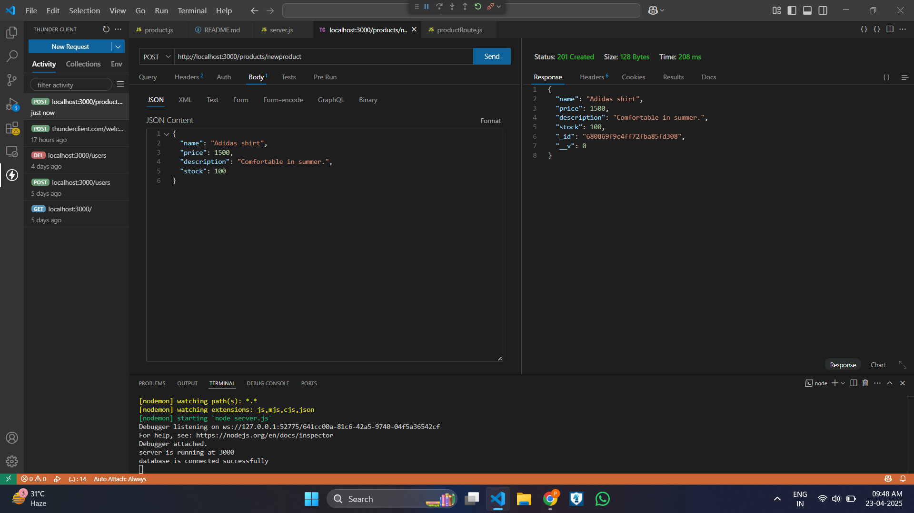 

2) Get method:To fetch all products (http://localhost:3000/products/) ->

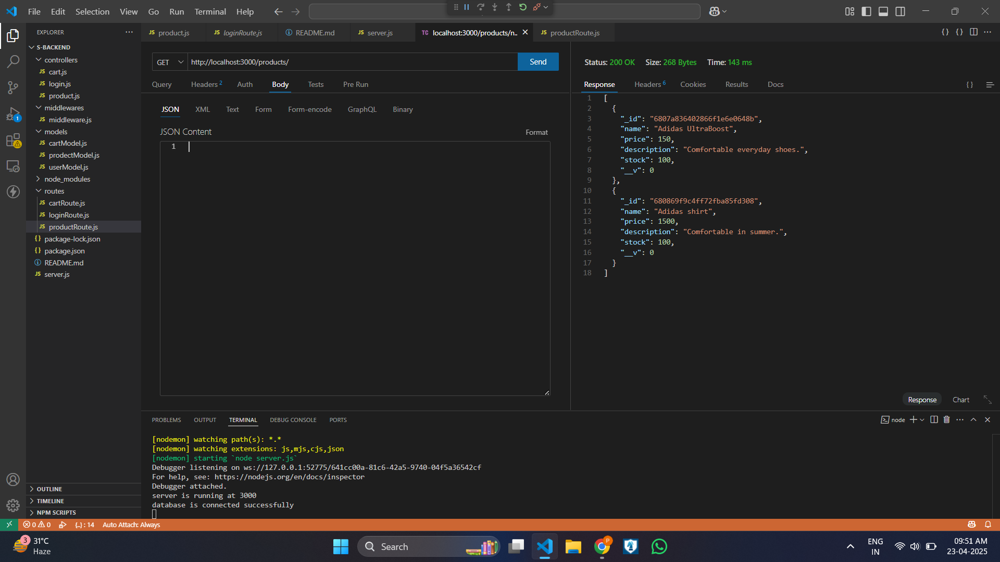 

3) Get method : To fetch particular product by id (http://localhost:3000/products/:id) 

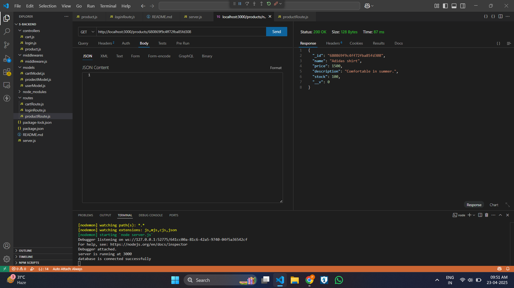

4) Post method : To register (http://localhost:3000/register)

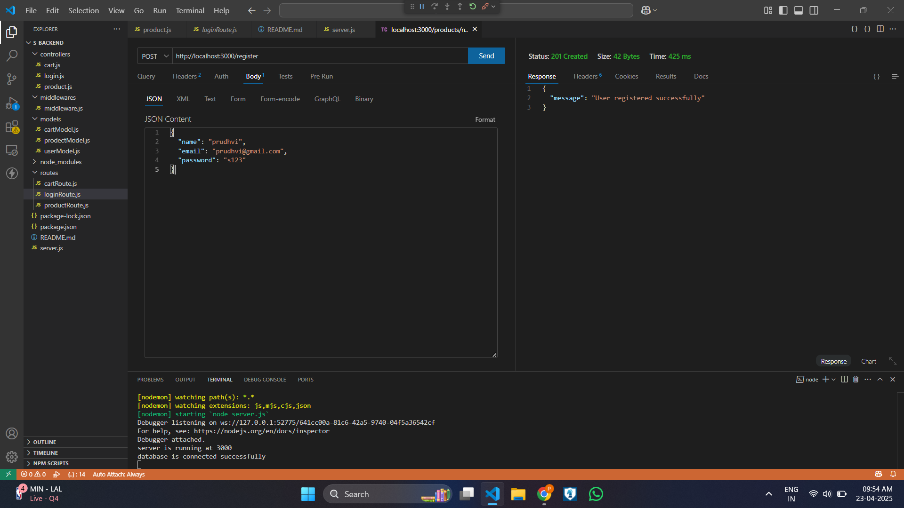

5) Post method : To login (http://localhost:3000/login)

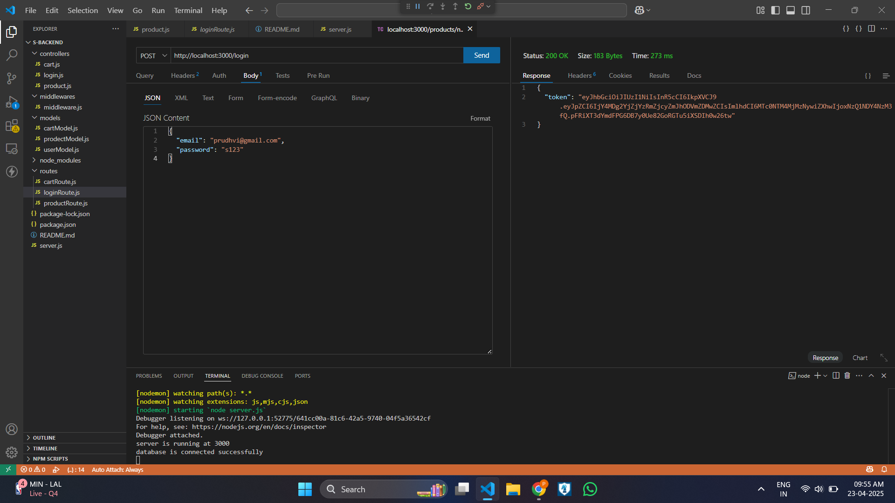

6) Delete method : To delete item from cart (http://localhost:3000/cart/:id)

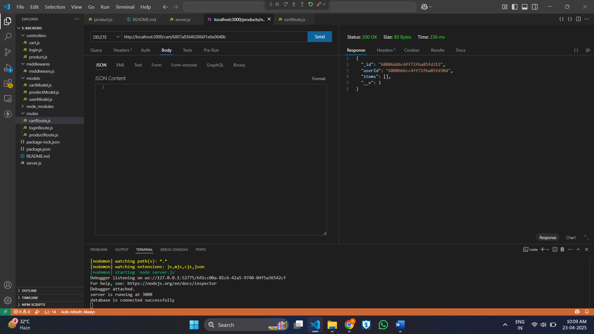

Mongo db collections :

7) users :

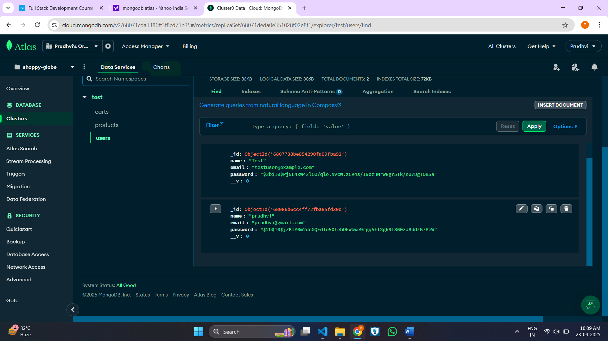

8) carts :

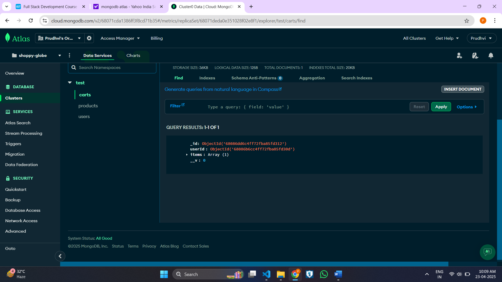

9) products :

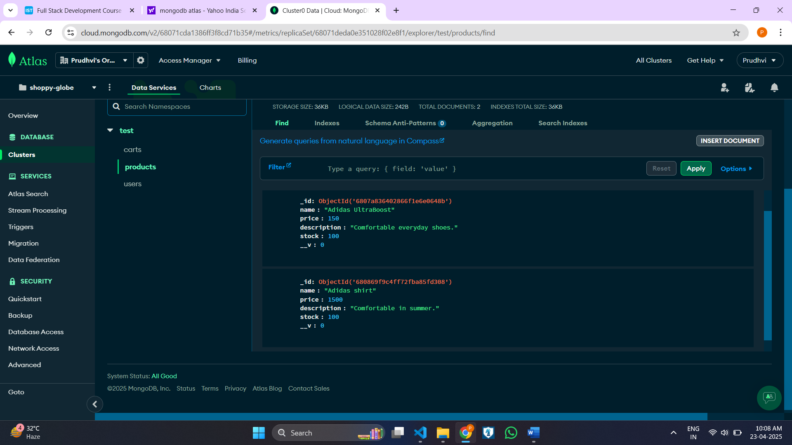 

10) Put method : To update items in the cart (http://localhost:3000/cart/:id) 

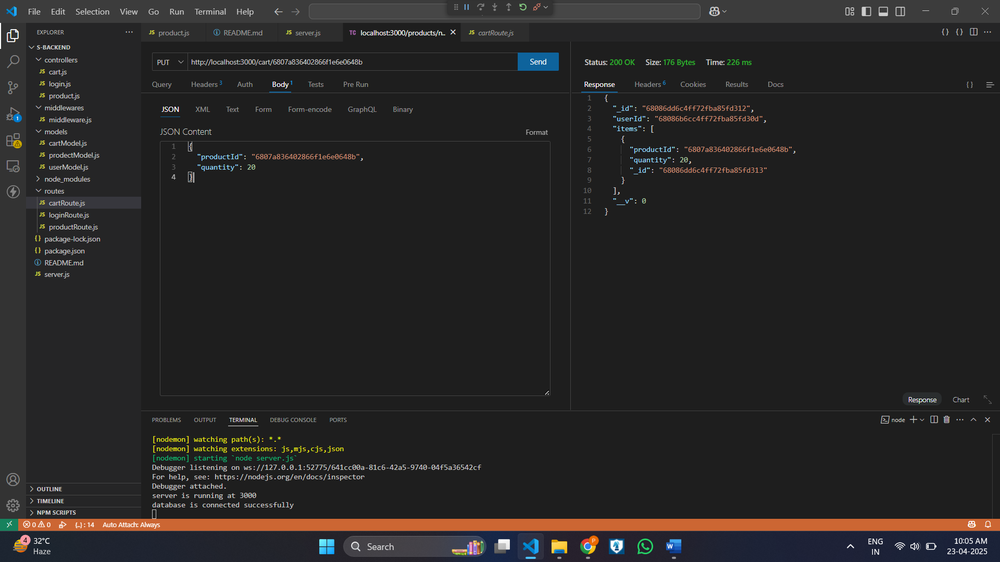 

11) Post method : To add items to the cart (http://localhost:3000/cart/) 

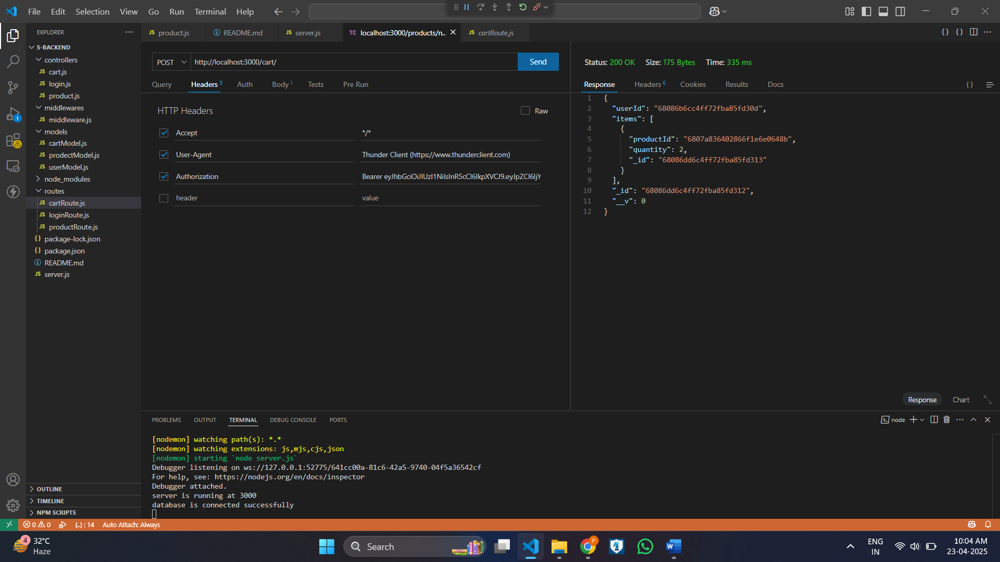 

12) Error Handling : fetching invalid product id 

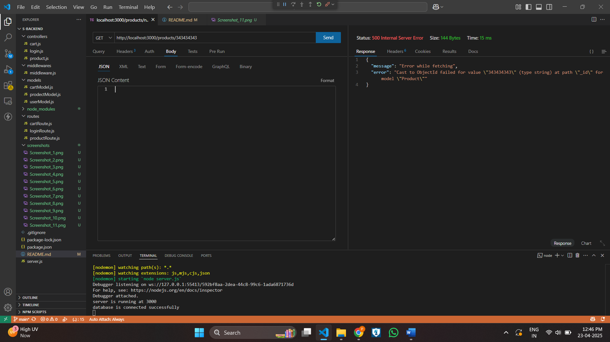 

